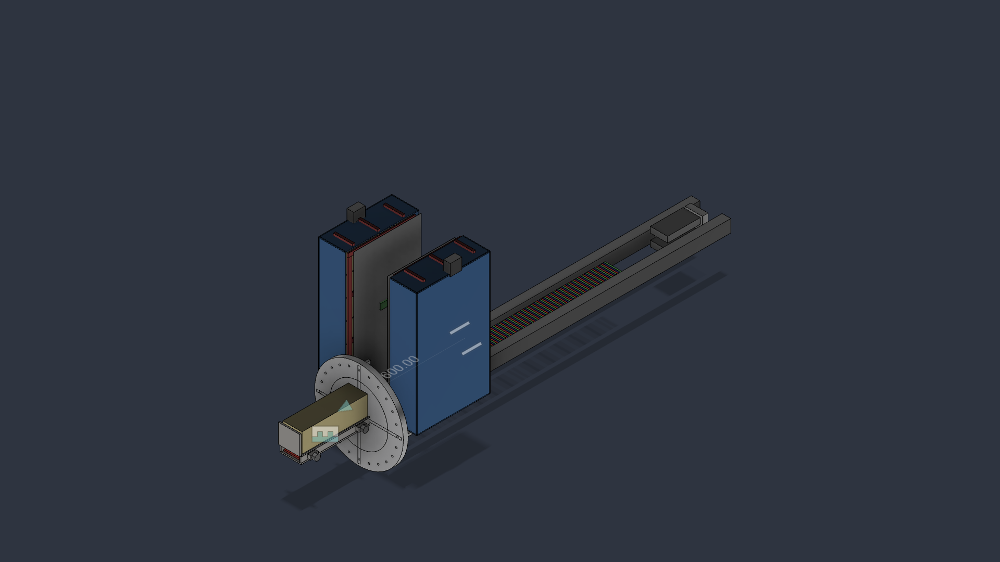
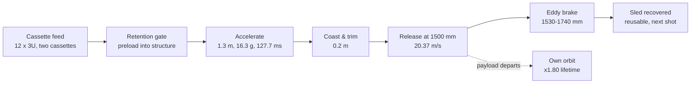
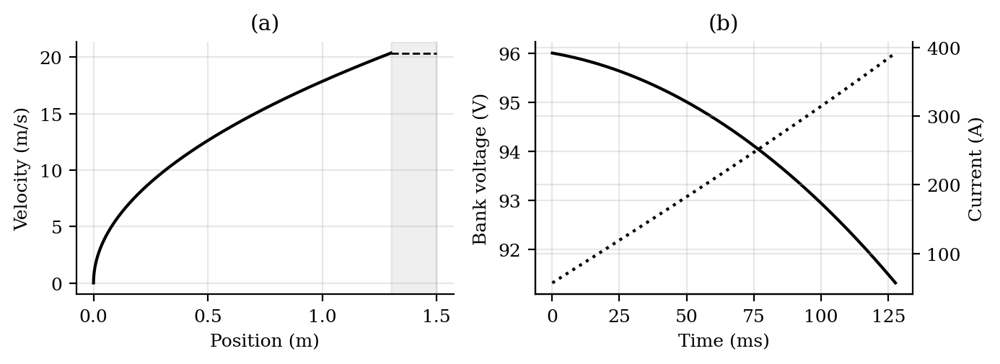
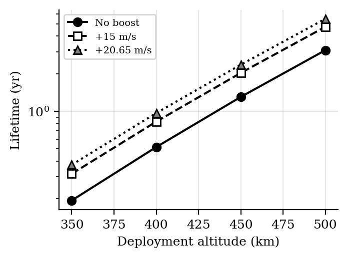
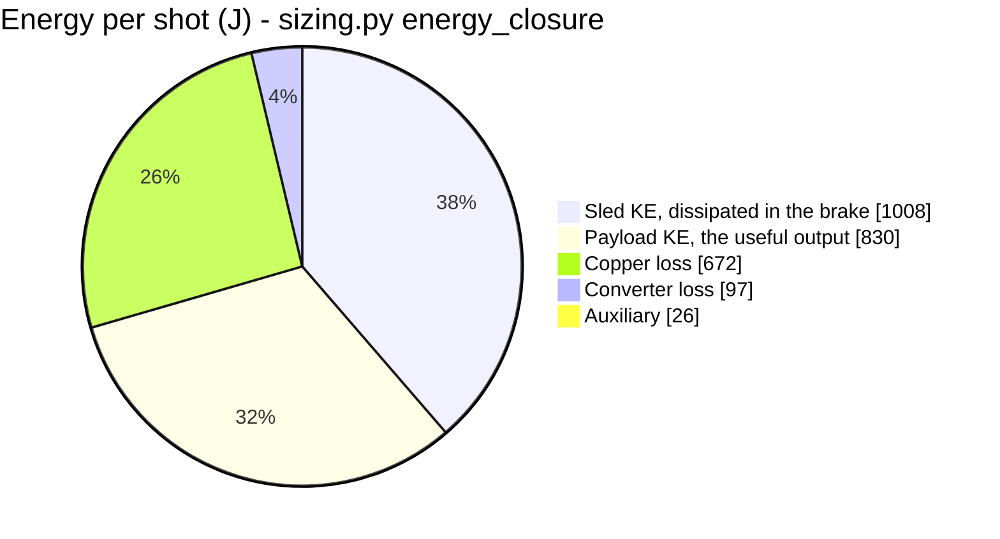
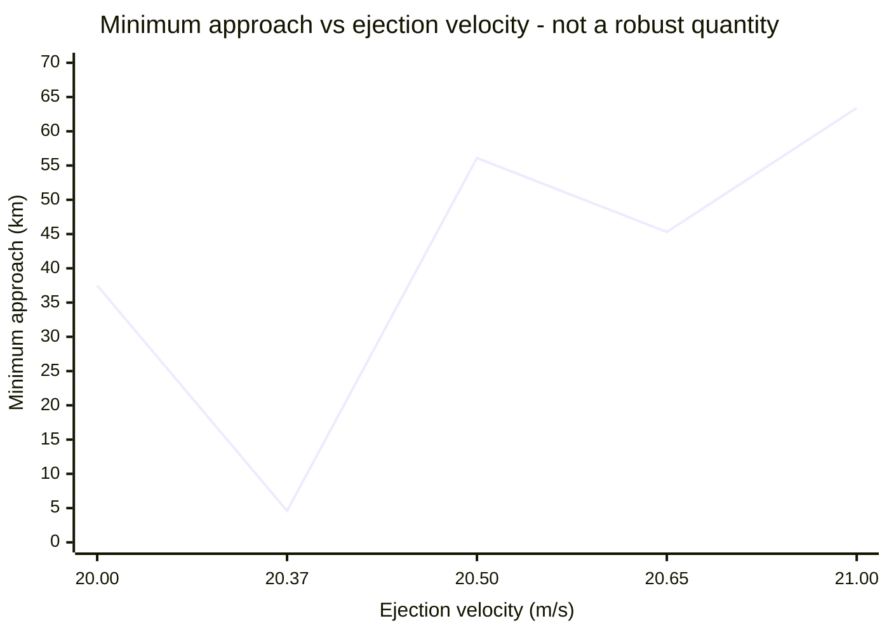

# EMOCD — Electromagnetic Orbital CubeSat Deployer

<p align="center">
  
</p>

[](LICENSE)
[](requirements.txt)
[](OPEN_PROBLEMS.md)
[](PROVENANCE.md)

A magazine-fed electromagnetic deployer that ejects unmodified CubeSats from a host
stage at programmable velocity, aimed at the unserved regime between spring deployers
(~2 m/s) and propulsive orbital transfer vehicles (hundreds of m/s).

**Status: design study, TRL 2–3. CAD complete across 9 Fusion 360 documents in three
generations, STEP exports committed (`cad/`, Gen3 current); FEA and hardware still
outstanding.**
**Read `PROVENANCE.md` before citing anything here.**

## The idea

CubeSats flown as rideshare secondaries inherit the primary customer's orbit. The
spring that ejects them adds 1–2 m/s — enough to drift clear, not enough to change an
orbit. A satellite with no propulsion of its own is stuck there for life.

EMOCD replaces the spring with an ironless double-sided Halbach linear synchronous
motor driving a reusable magnetic sled along a 1.5 m track. Twelve 3U CubeSats feed
from two transverse cassettes and are fired one at a time. The satellite is never
modified — the magnets ride the sled, not the payload.

<table>
<tr>
<td width="50%"><a href="cad/renders/interior_open.png"></a><br><sub><b>Interior.</b> Track, stator belts, sled, and both cassettes with the enclosure open.</sub></td>
<td width="50%"><a href="cad/renders/exploded_view.png"></a><br><sub><b>Exploded.</b> The nine documents: track, stator, sled, cassettes, brake, ESPA interface, enclosure, payload.</sub></td>
</tr>
<tr>
<td width="50%"><a href="cad/renders/exterior_aft_mounting.png"></a><br><sub><b>Aft mounting.</b> Ø460 mm ring flange, Ø400 mm bolt circle, 24 holes, four gussets.</sub></td>
<td width="50%"><a href="cad/renders/seq2_midstroke.png"></a><br><sub><b>Mid-stroke.</b> Sled under thrust, payload still cradled, 127.7 ms from breech to release.</sub></td>
</tr>
</table>

**Spin it in the browser:** [`cad/stl/EMOCD_Assembly_Gen3.stl`](cad/stl/EMOCD_Assembly_Gen3.stl)
and [`cad/stl/EMOCD_Sled_Gen3.stl`](cad/stl/EMOCD_Sled_Gen3.stl) — GitHub renders STL
natively, so click either and drag. They are derived meshes; `cad/step/gen3/` is the master
geometry ([why](cad/stl/README.md)).

## How a shot works



The satellite is never modified: the magnets ride the sled, not the payload. The sled's
kinetic energy is dissipated in the brake by design, which is why efficiency is quoted
electrical-to-payload and carries no regeneration credit.

## Headline results (all model outputs, not measurements)

| Quantity | Value | Source |
|---|---|---|
| Thrust constant | 11.22 N per kA/m, ±1.26 % ripple | `analysis/motor_model.py` |
| Exit velocity, 3U | 20.37 m/s at 16.3 g | `analysis/motor_model.py` |
| Electrical→payload efficiency | 32 % (2.63 kJ drawn, 830 J delivered) | `analysis/motor_model.py` |
| Closed-loop dispersion | 0.027 m/s (3σ) → ±0.10 km apogee | `analysis/motor_model.py` |
| Orbital lifetime multiplier | ×1.80, invariant across BC and solar activity | `analysis/astro.py` |
| Constellation seeding | 30° in 1.4–6.9 days vs 25 days by differential drag | `analysis/astro.py` |
| Dry / loaded mass | 72.3 kg / 120.3 kg | `analysis/mass_properties.py` |
| Recoil per shot | 81.5 N·s | `analysis/astro.py` |
| Track first mode | 109 Hz fixed-fixed (target >70) | `analysis/sizing.py` |
| Energy closure | 100.1 % accounted | `analysis/sizing.py` |

> **⚠ CAD structural reconciliation pending (P8).** The figures above are the script
> outputs and assume the 4.86 kg parametric sled mass from `mass_properties.py`. The
> first-pass Fusion CAD sled (6 mm Ti-6Al-4V chassis, no structural FEA behind it) comes
> out heavier — provisionally **~7.50 kg** — which would lower exit velocity to a
> provisional **~17.88 m/s** and shift efficiency, recoil, and the lifetime multiplier
> with it. **These numbers are deliberately left as the scripts compute them** until
> ANSYS structural analysis closes the sled mass. The scripts stay authoritative; the CAD
> is authoritative for geometry and fit only. See `OPEN_PROBLEMS.md` P5/P8 and
> `cad/parameters.json`.

Two results have independent cross-checks: the Halbach field model (analytic vs
magpylib, agreeing to three digits) and orbital decay (orbit-averaged vs Cowell RK4,
99.4 %). Everything else is single-sourced.

## Reproducing

```bash
pip install -r requirements.txt
cd analysis
python3 verify_field.py && python3 mass_properties.py && python3 motor_model.py && python3 sizing.py && python3 astro.py
```

Results land in `analysis/results/*.json`.

<table>
<tr>
<td width="50%"><br><sub><b>The shot.</b> Force, velocity and current through the 127.7 ms stroke (<code>motor_model.py</code>).</sub></td>
<td width="50%"><br><sub><b>Lifetime.</b> Boosted vs unboosted decay — the x1.80 multiplier is the claim, not the absolute years (<code>astro.py</code>).</sub></td>
</tr>
</table>

## Validation

**[`VALIDATION_REPORT.md`](VALIDATION_REPORT.md)** — every claim, independently checked where
possible. Headlines: the scripts reproduce themselves exactly (173/173 values); GMAT
confirms the ×1.80 lifetime multiplier to within 4 % and its invariance to 2.55 %; ngspice
confirms the shot model but finds the quoted bank sag is state-of-charge, not terminal
voltage; and the Gen3 sled measures **9.45 kg**, above both existing estimates, which puts
exit velocity at 16.5 m/s rather than 20.37 (**P15**).

## Charts

Full set in **[`RESULTS.md`](RESULTS.md)** — all drawn by GitHub from text, no image files.
Two that carry the argument:



830 J of 2630 J drawn reaches the payload. That is the 32 %, and it carries no regeneration
credit because the sled's 1008 J is thrown away in the brake by design.



A ±2.5 % velocity change moves the conjunction minimum from 4.6 km to 63.4 km. That is why
the paper's safety claim was reframed onto the 8.1-day realignment period instead of a
single distance (P1).

## Validation status

Each analysis has its acceptance band declared **before** the run, in
[`validation/`](validation/). A5 has now been run under GMAT; the rest have not — a cross-check whose target is chosen after seeing the
answer proves nothing.

| Analysis | Tool | Closes | Status |
|---|---|---|---|
| A1 airgap field | FEMM | E1 (2-D half), E2 | specified |
| **A4 sled chassis** | CalculiX / Code_Aster | **P5, P8 — the headline number** | specified |
| A5 lifetime & seeding | GMAT R2022a | E6 | **run** — see [`RESULTS.md`](RESULTS.md) |
| A6 conjunction Pc | NASA CARA | P1 | specified |
| A7 separation & tip-off | Project Chrono | E7 | specified |
| A8 pulse-power chain | ngspice | E17 | specified |

## Repository layout

- `analysis/` — current scripts; these reproduce the numbers above
- `analysis/femm/` — FEMM magnetostatics package: `emocd_cross_section.dxf` + `FEMM_RUN_SHEET.md` (analysis A1, not yet run)
- `cad/` — Fusion 360 CAD: `parameters.json` (geometry source of truth, 9 documents),
  `step/gen1|gen2|gen3/` exports (**Gen3 current**), `stl/` (browser-viewable meshes),
  `renders/`, `CHANGELOG_CAD.md` (generation history and per-file defect list)
- `legacy/` — superseded scripts, kept for history, **do not cite**
- `paper/` — IEEE conference paper (LaTeX source, figures, PDF)
- `validation/` — independent cross-check plan (FEMM, CalculiX, Orekit, CARA, Chrono),
  each with an acceptance band declared before the run; nothing run yet
- `docs/` — computation notes, FEMM run sheet, related work and comparator sources
- `docs/PROJECT_NOTES.md` — working context: ground rules, layout, locked decisions
- `docs/LANDSCAPE.md` — how this compares with deployers that actually fly
- `docs/DESIGN_OPTIONS_exit_velocity.md` — options for the P15 velocity shortfall, costed
- `INVENTORY.md` — complete indexed catalogue of every calculation, decision and artifact
- `docs/DECISION_LOG.md` — why each design change happened, including two self-corrections
- `PROVENANCE.md` — what came from where, and what was never verified
- `OPEN_PROBLEMS.md` — known errors in the paper, and unsolved engineering

## Known issues

The published paper previously contained four numbers its own scripts did not reproduce
(conjunction minimum, peak current, far-field stray values, brake fin temperature rise),
all found by reconstructing the analysis from scratch. **All four were corrected in
`paper/paper.tex` on 2026-07-23 to match the scripts**, and the conjunction claim was
additionally reframed because that minimum is not a robust quantity. Note that
`paper/archive/EMOCD_submission_uncorrected.pdf` still carries the uncorrected values —
whether that build is the one that was submitted is open (`OPEN_PROBLEMS.md` P11). Full record with
cause, before/after, and references is in `CHANGELOG.md`; the original defects remain
documented in `OPEN_PROBLEMS.md` P1–P4 for the audit trail.

## Author

Adityavardhan Mishra — Department of Mechanical Engineering, Symbiosis Institute of
Technology, Symbiosis International (Deemed University), Pune. Project begun April 2021.
