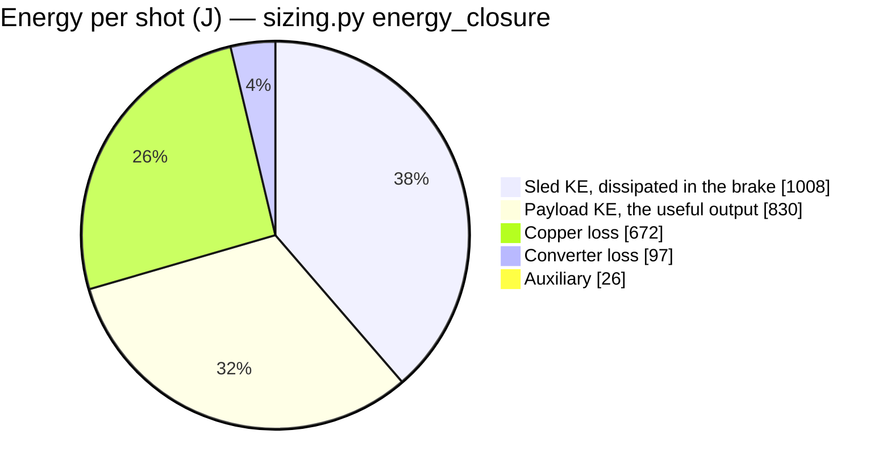
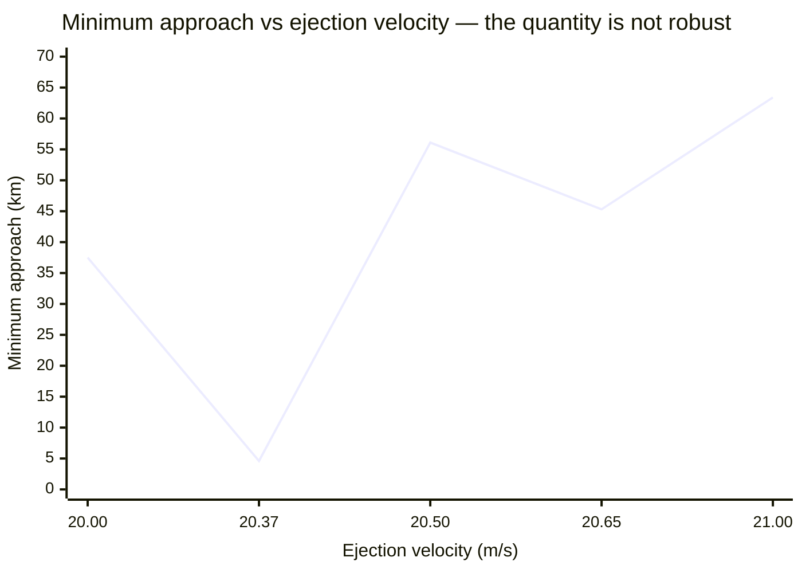
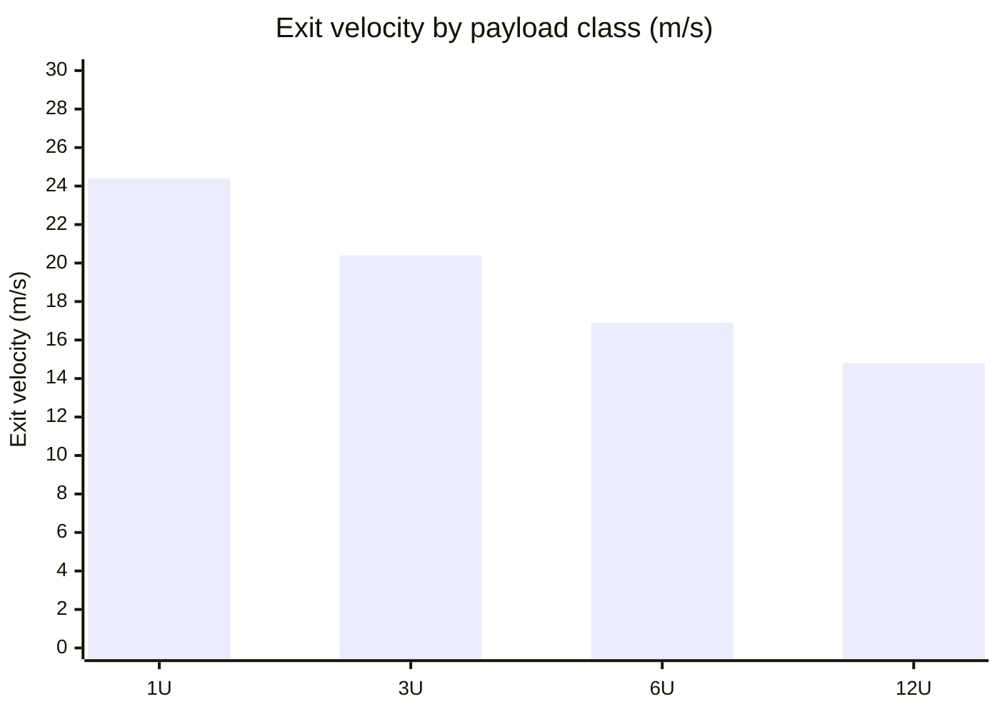
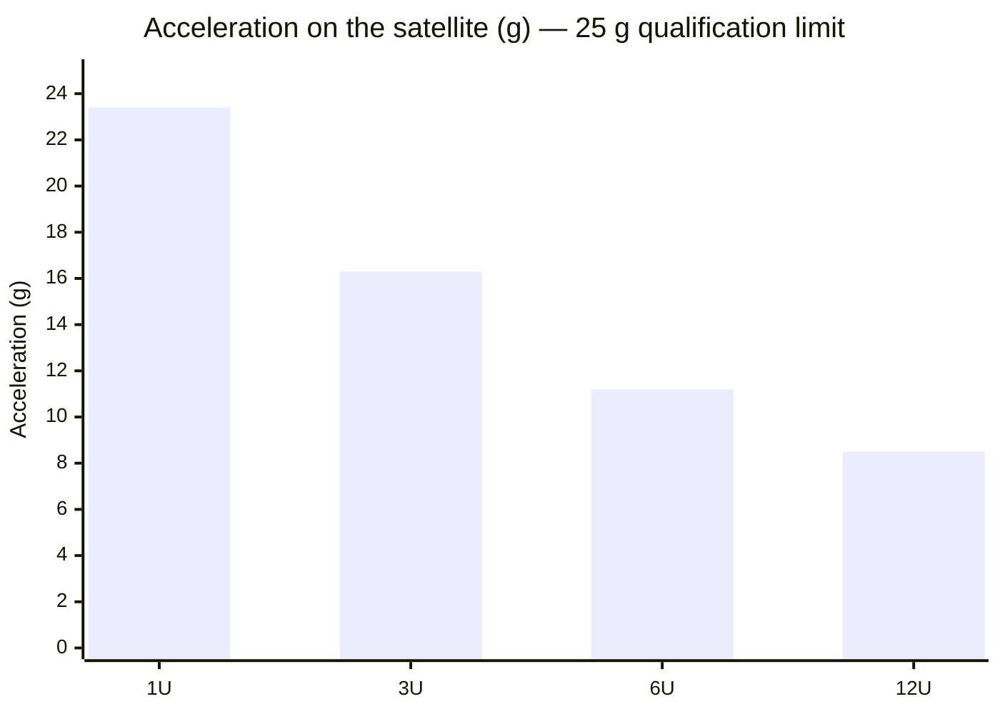
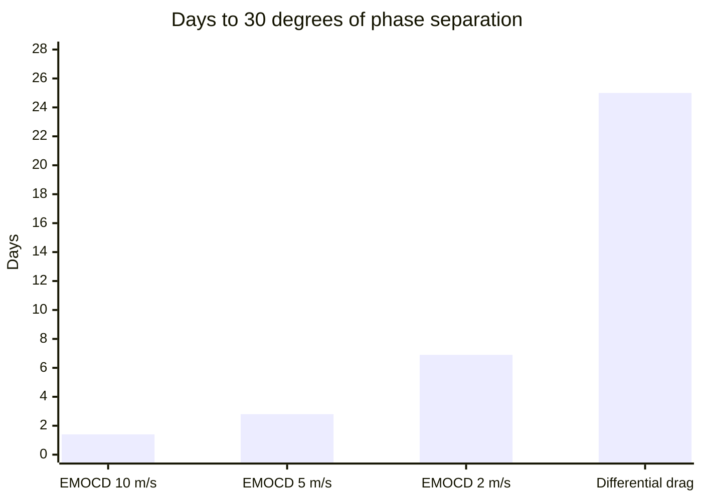
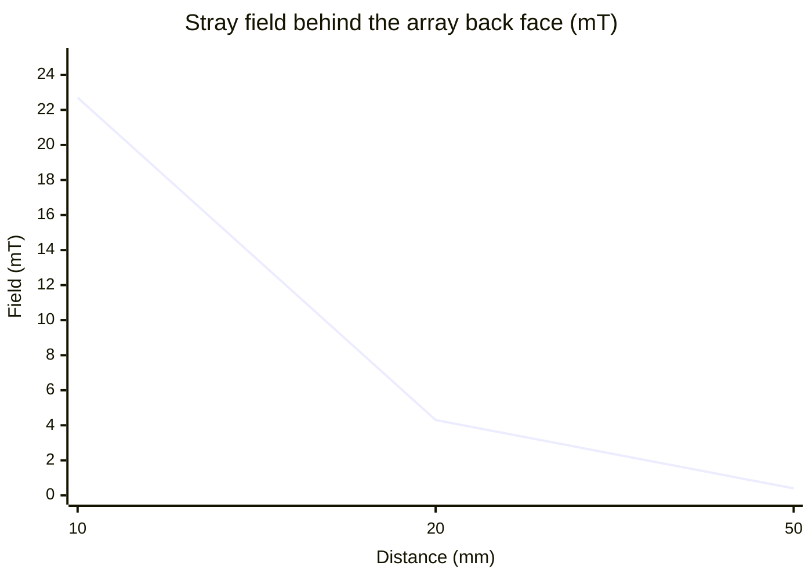
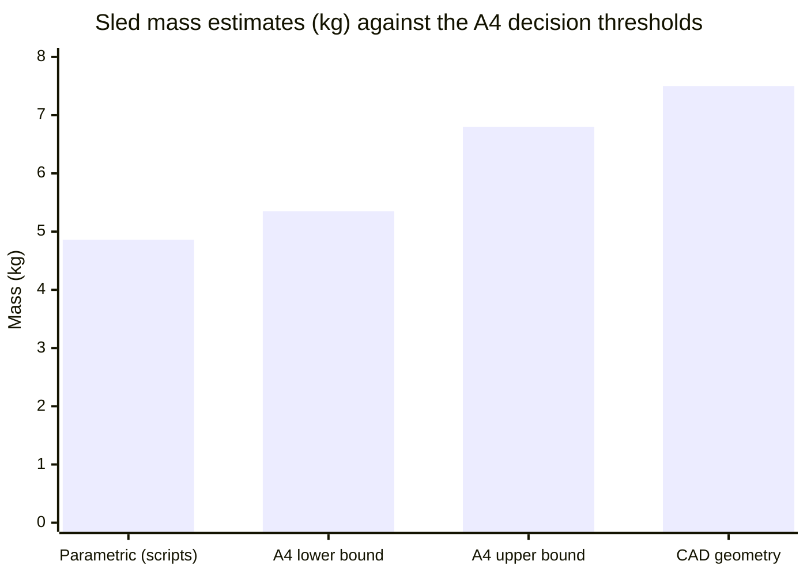
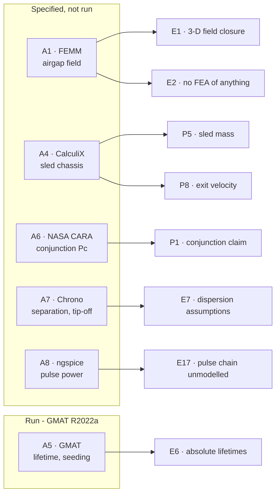
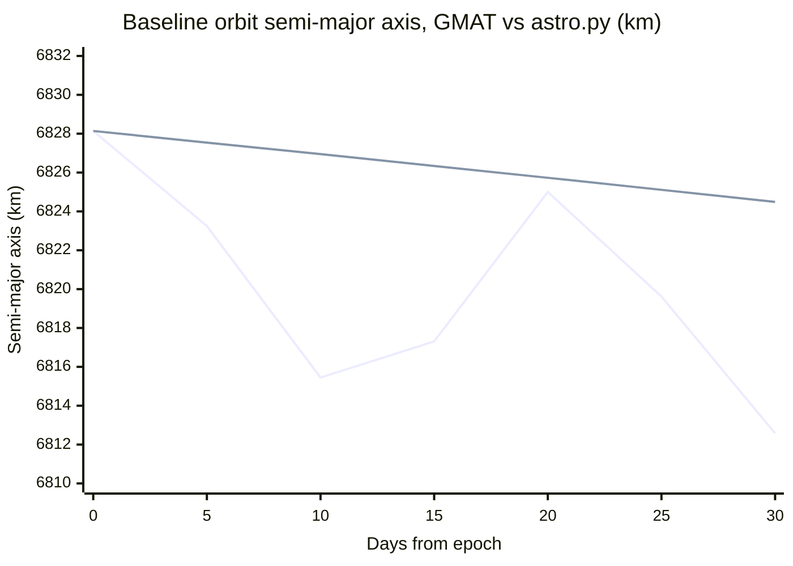
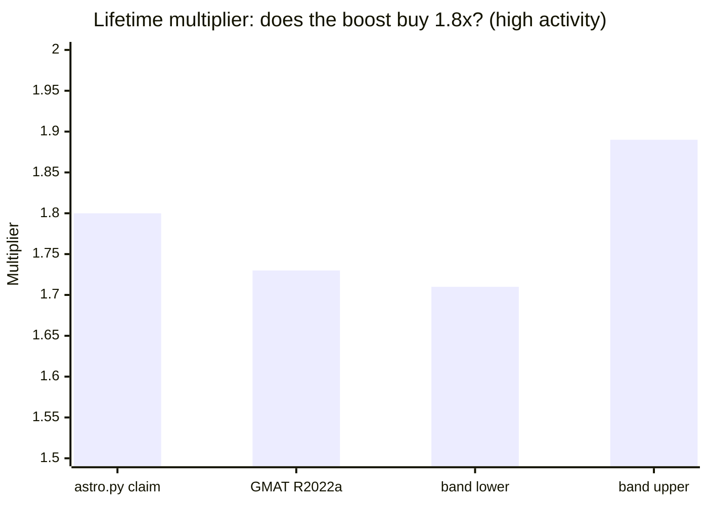

# Results, in charts

Everything here is drawn by GitHub from text — no image files. Every value traces to a
field in `analysis/results/*.json`, named under each chart, and nothing has been rounded
in a direction that flatters it.

**These are model outputs.** Nothing in this file has been measured, and only two results
carry an independent cross-check. See [`PROVENANCE.md`](PROVENANCE.md).

---

## Where the energy goes

2630 J leaves the capacitor bank per shot. 830 J of it ends up as payload kinetic energy —
that is the 32 % figure, and it is electrical-to-payload with **no regeneration credit**,
because the sled's 1008 J is dissipated in the eddy brake by design.

Accounted 2633 J against 2630 J drawn — 100.1 % closure, which is the arithmetic check that
the budget has no missing term. Source: `analysis/results/sizing.json` → `energy_closure`.

An earlier version of this project claimed 52 % efficiency by crediting 55 % of the sled's
energy back as regeneration. That was double-counting: the arrest architecture throws that
energy away. The correction to 32 % is recorded as A25/A27 in
[`INVENTORY.md`](INVENTORY.md).

---

## Why the conjunction claim was reframed

This is the most instructive chart in the repository. It plots the 30-day minimum
satellite-to-stage approach distance against ejection velocity.

A ±2.5 % change in velocity moves the answer by more than an order of magnitude, from
4.6 km to 63.4 km. It is a near-resonant beat sample, not a design property. The paper
originally quoted a single figure — 45.3 km — as a safety result. It now rests on the
**8.1-day phase realignment period**, which is robust, plus mandatory per-shot collision
avoidance and host-stage disposal before first realignment.

Source: the P1 sweep table in [`OPEN_PROBLEMS.md`](OPEN_PROBLEMS.md), computed by
`analysis/astro.py` `conjunction()`. `validation/A6_conjunction_cara.md` specifies the
quantitative replacement — probability of collision, which integrates over the covariance
instead of sampling one geometry.

---

## Payload family

Exit velocity is force-limited, so heavier classes go slower at lower acceleration. Only
the 3U case is designed; 6U and 12U are arithmetic from the same thrust constant, with no
mechanism or cassette behind them (`OPEN_PROBLEMS.md` E9).

The 1U case at 23.4 g sits close to the 25 g limit that standard qualification testing
assumes — the ceiling is the payload's tolerance, not the motor. Source:
`analysis/results/motor_results.json` → `family`.

---

## Seeding: the actual value proposition

Time to spread a constellation 30° apart, by ejection velocity, against the
differential-drag baseline.

Source: `analysis/results/astro_results.json` → `seeding_days`. **Caveat worth reading:**
the 25-day comparator is a model output of `astro.py`, not a measurement. Foster et al.
published *flown* differential-drag phasing results for 12 Planet Labs CubeSats at 510 km;
replacing the modelled baseline with the measured one is the cheapest credibility
improvement available to this project (`docs/RELATED_WORK.md`).

---

## Stray field falloff

Sets the magnetic keep-out for satellites still in the cassettes.

Source: `analysis/results/field_verification.json` → `stray_field`. The 20 mm and 50 mm
values were wrong in the published paper (4.7 and 1.0 mT) and were corrected against the
script — P3, logged in [`CHANGELOG.md`](CHANGELOG.md) as P2-03. Far-field values are small
differences of large numbers and remain the least trustworthy row here.

---

## The sled mass conflict, and how it gets settled

Two estimates of the same part disagree by 54 %, and the headline exit velocity hangs off
which one is right.

The two middle bars are **not measurements** — they are the decision rule declared in
[`validation/A4_sled_structural.md`](validation/A4_sled_structural.md) before the analysis
runs:

| Outcome | Consequence |
|---|---|
| ≤ 5.35 kg | Parametric model stands. 20.37 m/s holds, P5 and P8 close |
| 5.35 – 6.80 kg | Neither estimate right. Scripts move, then the paper |
| ≥ 6.80 kg | **17.88 m/s becomes the headline** and the paper changes materially |

Fixing the thresholds in advance is the point. After the run, the temptation will be to
pick whichever threshold preserves 20.37 m/s.

---

## Validation status

Six analyses, each with its acceptance band declared before the run. Progress so far:

| Analysis | Status |
|---|---|
| A1 airgap field | `░░░░░░░░░░` specified |
| A4 sled chassis | `███░░░░░░░` mass measured (**9.45 kg**, P15); stiffness not run |
| A5 lifetime & seeding | `████████░░` **GMAT: ×1.73 vs ×1.80, within band** (high activity); mean/low running |
| A6 conjunction Pc | `░░░░░░░░░░` specified |
| A7 separation & tip-off | `░░░░░░░░░░` specified |
| A8 pulse-power chain | `██████████` **run — ngspice, all bands met, 2 findings** |

## GMAT cross-check (A5) — first real validation output

GMAT R2022a was installed and run headless. This is the first number in this project
produced by something other than its own scripts.

### Decay rate over a bounded 30-day window

First line GMAT, second `astro.py`. The GMAT curve wanders because **reported SMA is
osculating** — short-period J2 and lunisolar terms run 12.2 km peak to peak here, several
times the decay over the whole window. `astro.py` integrates mean elements, so its curve is
smooth. Differencing the endpoints of the two would be meaningless; the honest comparison is
the fitted rate:

| | Decay rate | Method |
|---|---|---|
| GMAT | **−0.1618 km/day** | least squares over 31 daily samples, residual RMS 4.24 km |
| `astro.py` | **−0.1216 km/day** | 30-day Cowell integration, `cowell_sma_after()` |
| Ratio | **1.33×** | GMAT decays faster |

**A 33 % difference in absolute decay rate is not a failure**, and E6 says so in advance:
`astro.py` uses a static exponential atmosphere at "mean activity" while GMAT uses MSISE90
at F10.7 = 150, and those are not the same thing. The claim this project defends is the
ratio between boosted and unboosted lifetimes, not the years.

An internal consistency check fell out of it: a 1.33× faster decay predicts the
high-activity case reaching 120 km at 190 / 1.33 ≈ 143 days. GMAT's full run gives
**144.5 days**. The bounded window and the full decay agree with each other.

### Full decay runs — the ×1.80 claim, checked

High solar activity (F10.7 = 250), propagated to the 120 km floor:

| | Baseline | Boosted | Multiplier |
|---|---|---|---|
| GMAT R2022a, MSISE90 | 144.5 days | 250.0 days | **1.7302** |
| `astro.py` | 190 days (0.52 yr) | — | 1.80 |
| | | Deviation | **−3.88 %** |

**Inside the ±5 % band declared before the run.** An independently implemented force model —
different atmosphere, 20×20 gravity, lunisolar third bodies, SRP, RK89 — reproduces the
project's headline astrodynamics claim to within 4 %.

Note what did *not* agree: the absolute baseline lifetime, 144.5 days against 190. That is
the 1.33× rate difference again, and E6 predicted it in advance. The ratio survives what the
absolutes do not, which is the entire argument for quoting the ratio.

Mean and low activity are still propagating (2.6 years of orbit at low activity takes a
while). Live verdict, force models and run metadata:
[`validation/results/A5_astro.json`](validation/results/A5_astro.json).

> **The parser earned its keep here.** Its first run read a decay file GMAT was still
> writing, took the partial decay as final, and produced a confident `FAIL`. It now refuses
> to report a multiplier unless the run actually reached the 120 km floor. A validation
> harness that reports a failure it cannot substantiate is worse than no harness.
